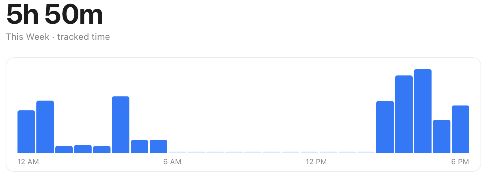
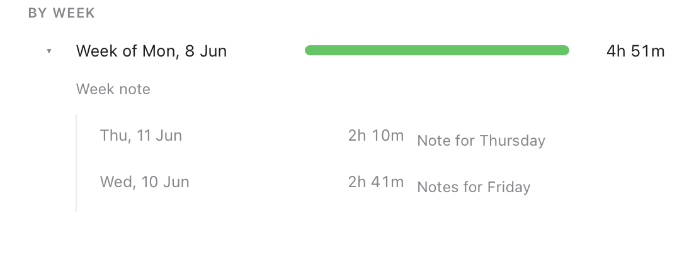

# Echo

Echo is a personal macOS time tracker that reflects back where your time went after
the fact. It runs quietly in the menu bar, records the active app and window title,
and lets you group tracked activity into projects.

This is a personal project first. The goal is to make time review lightweight:
open Echo, scan the day or week, drag apps or window titles into projects, and use
the project view to understand where the time went. It is not built for teams,
timesheets, billing, clients, rates, or invoices.



## Features

- Menu-bar tracking with pause, resume, open, and quit controls.
- Local app and window-title capture on macOS.
- Day, week, and month activity charts with per-app breakdowns.
- Per-project totals and app/title breakdowns.
- Drag app or title rows onto projects to assign time.
- Ignore noisy apps or window titles and restore them later.
- Day, week, and month project notes. Week views group day notes; month views
  group week notes.
- Local SQLite storage owned by the app.



## Privacy

Echo stores tracking data locally. It does not send activity, project names, window
titles, or notes to a server.

Window-title capture uses macOS Accessibility permission. Without that permission,
Echo falls back to app-level tracking.

## Project Status

Echo is early-stage software and is being built around a personal workflow. Expect
rough edges, schema changes, and macOS-first assumptions.

## Requirements

- macOS
- Bun
- Rust
- Tauri prerequisites for macOS, including Xcode Command Line Tools

## Install

Echo is currently distributed as a private, unsigned macOS build. Download the
latest DMG from GitHub Releases, drag Echo into Applications, then open it from
Finder.

Because the build is unsigned, macOS may require manual approval in System
Settings before first launch. For a public release, Echo should be Developer ID
signed and notarized.

## Development

Install dependencies:

```sh
bun install
```

Run the app in development:

```sh
bun run tauri dev
```

Build the frontend:

```sh
bun run build
```

Run frontend tests:

```sh
bun run test
```

Run frontend coverage:

```sh
bun run test:coverage
```

Run Rust checks:

```sh
cd src-tauri
cargo fmt --all -- --check
cargo clippy --all-targets -- -D warnings
cargo test
```

Build a local macOS DMG:

```sh
bun run tauri build --bundles dmg
```

## Repository Layout

- `src/` - React UI.
- `src-tauri/` - Rust shell, tracker, SQLite storage, tray integration, and macOS capture.
- `.github/workflows/` - CI and draft-release automation.

## Release

See `RELEASE.md` for the private unsigned release checklist. The GitHub Actions
release workflow runs on `v*` tags or manual dispatch and creates a draft release
with macOS DMG artifacts.

## License

MIT. See `LICENSE`.
